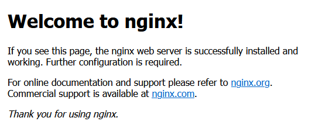
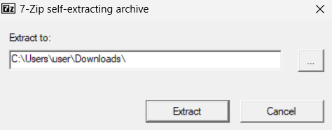

# How to install and configure Kepler

This guide details how to install and configure [Quackster's Kepler](https://github.com/Quackster/Kepler). It assumes a fresh install of `debian`, running everything on `localhost` and is intentionally over-simplified and verbose.

If you're setting this up on a remote host, make sure you read [Remote host setup](#remote-host-setup). 

#### Dependencies

- `sudo`
- `unzip`
- `mariadb`
- `jdk` (v17+)
- `nginx`
- `php`

## Outline

#### Setting up
Start by updating your packages and installing/configuring your new `sudo` user, and then switch to it. We'll be configuring the project on that user. Feel free to skip if you're not on `root` or have already done this.

```sh
root@svr:~$ apt update
root@svr:~$ apt install sudo -y
root@svr:~$ usermod -aG sudo user # replace 'user' with your name
root@svr:~$ su - user             # replace 'user' with your name
```
 Now install the dependencies and create your server's root directory. We'll be using `/opt/server`.

 ```sh
user@svr:~$ sudo apt install unzip mariadb-server default-jdk nginx php -y
user@svr:~$ mkdir /opt/server
```

#### Downloading the server
Download the latest server release. As of writing this, it's v1.5. Hopefully there are many more updates to come. When you `unzip` the files, it creates a subdirectory named `Kepler.v1.5`. You can leave that if you wish, but this guide moves everything up to /opt/server and deletes that directory.

```sh
user@svr:~$ cd /opt/server
user@svr:/opt/server$ wget -O server.zip https://github.com/Quackster/Kepler/releases/download/v1.5/Kepler.v1.5.zip
user@svr:/opt/server$ unzip server.zip
user@svr:/opt/server$ mv Kepler.v1.5/* .
user@svr:/opt/server$ rm -R Kepler.v1.5
```

Before we can move on, notice the `run.sh` file. This is what starts the server.

```sh
user@svr:/opt/server$ ls
README_SnowStorm.txt  kepler.jar  keplerdb.sql  lib  migrations  run.bat  run.sh  server.zip  tools
```

We need to start it to generate the `server.ini` file. You're going to see a bunch of errors, don't worry about them

```sh
user@svr:/opt/server$ sudo bash run.sh
  _  __          _
 | |/ /___ _ __ | | ___ _ __
 | ' // _ \ '_ \| |/ _ \ '__|
 | . \  __/ |_) | |  __/ |
 |_|\_\___| .__/|_|\___|_|
          |_|
2024-06-02T17:31:32.190 INFO  [org.alexdev.kepler.Kepler] - Kepler - Habbo Hotel Emulation (revision v1.4)
2024-06-02T17:31:32.191 INFO  [org.alexdev.kepler.dao.Storage] - Connecting to MySQL server
2024-06-02T17:31:32.206 INFO  [com.zaxxer.hikari.HikariDataSource] - processing - Starting...
2024-06-02T17:31:32.263 ERROR [com.zaxxer.hikari.pool.HikariPool] - processing - Exception during pool initialization.
java.sql.SQLInvalidAuthorizationSpecException: Access denied for user 'kepler'@'localhost'
        at org.mariadb.jdbc.internal.util.exceptions.ExceptionMapper.get(ExceptionMapper.java:232)
        at org.mariadb.jdbc.internal.util.exceptions.ExceptionMapper.getException(ExceptionMapper.java:165)
        at org.mariadb.jdbc.internal.protocol.AbstractConnectProtocol.connectWithoutProxy(AbstractConnectProtocol.java:1199)
        at org.mariadb.jdbc.internal.util.Utils.retrieveProxy(Utils.java:560)
        at org.mariadb.jdbc.MariaDbConnection.newConnection(MariaDbConnection.java:174)
        at org.mariadb.jdbc.Driver.connect(Driver.java:92)
        at com.zaxxer.hikari.util.DriverDataSource.getConnection(DriverDataSource.java:138)
        at com.zaxxer.hikari.pool.PoolBase.newConnection(PoolBase.java:353)
        at com.zaxxer.hikari.pool.PoolBase.newPoolEntry(PoolBase.java:201)
        at com.zaxxer.hikari.pool.HikariPool.createPoolEntry(HikariPool.java:473)
        at com.zaxxer.hikari.pool.HikariPool.checkFailFast(HikariPool.java:562)
        at com.zaxxer.hikari.pool.HikariPool.<init>(HikariPool.java:115)
        at com.zaxxer.hikari.HikariDataSource.<init>(HikariDataSource.java:81)
        at org.alexdev.kepler.dao.Storage.<init>(Storage.java:51)
        at org.alexdev.kepler.dao.Storage.connect(Storage.java:71)
        at org.alexdev.kepler.Kepler.main(Kepler.java:85)
Caused by: java.sql.SQLException: Access denied for user 'kepler'@'localhost'
        at org.mariadb.jdbc.internal.protocol.AbstractConnectProtocol.authentication(AbstractConnectProtocol.java:934)
        at org.mariadb.jdbc.internal.protocol.AbstractConnectProtocol.handleConnectionPhases(AbstractConnectProtocol.java:850)
        at org.mariadb.jdbc.internal.protocol.AbstractConnectProtocol.connect(AbstractConnectProtocol.java:507)
        at org.mariadb.jdbc.internal.protocol.AbstractConnectProtocol.connectWithoutProxy(AbstractConnectProtocol.java:1195)
        ... 13 more
2024-06-02T17:31:32.265 ERROR [ErrorLogger] - Error when executing MySQL query:
com.zaxxer.hikari.pool.HikariPool$PoolInitializationException: Failed to initialize pool: Access denied for user 'kepler'@'localhost'
        at com.zaxxer.hikari.pool.HikariPool.throwPoolInitializationException(HikariPool.java:597)
        at com.zaxxer.hikari.pool.HikariPool.checkFailFast(HikariPool.java:576)
        at com.zaxxer.hikari.pool.HikariPool.<init>(HikariPool.java:115)
        at com.zaxxer.hikari.HikariDataSource.<init>(HikariDataSource.java:81)
        at org.alexdev.kepler.dao.Storage.<init>(Storage.java:51)
        at org.alexdev.kepler.dao.Storage.connect(Storage.java:71)
        at org.alexdev.kepler.Kepler.main(Kepler.java:85)
Caused by: java.sql.SQLInvalidAuthorizationSpecException: Access denied for user 'kepler'@'localhost'
        at org.mariadb.jdbc.internal.util.exceptions.ExceptionMapper.get(ExceptionMapper.java:232)
        at org.mariadb.jdbc.internal.util.exceptions.ExceptionMapper.getException(ExceptionMapper.java:165)
        at org.mariadb.jdbc.internal.protocol.AbstractConnectProtocol.connectWithoutProxy(AbstractConnectProtocol.java:1199)
        at org.mariadb.jdbc.internal.util.Utils.retrieveProxy(Utils.java:560)
        at org.mariadb.jdbc.MariaDbConnection.newConnection(MariaDbConnection.java:174)
        at org.mariadb.jdbc.Driver.connect(Driver.java:92)
        at com.zaxxer.hikari.util.DriverDataSource.getConnection(DriverDataSource.java:138)
        at com.zaxxer.hikari.pool.PoolBase.newConnection(PoolBase.java:353)
        at com.zaxxer.hikari.pool.PoolBase.newPoolEntry(PoolBase.java:201)
        at com.zaxxer.hikari.pool.HikariPool.createPoolEntry(HikariPool.java:473)
        at com.zaxxer.hikari.pool.HikariPool.checkFailFast(HikariPool.java:562)
        ... 5 more
Caused by: java.sql.SQLException: Access denied for user 'kepler'@'localhost'
        at org.mariadb.jdbc.internal.protocol.AbstractConnectProtocol.authentication(AbstractConnectProtocol.java:934)
        at org.mariadb.jdbc.internal.protocol.AbstractConnectProtocol.handleConnectionPhases(AbstractConnectProtocol.java:850)
        at org.mariadb.jdbc.internal.protocol.AbstractConnectProtocol.connect(AbstractConnectProtocol.java:507)
        at org.mariadb.jdbc.internal.protocol.AbstractConnectProtocol.connectWithoutProxy(AbstractConnectProtocol.java:1195)
        ... 13 more
2024-06-02T17:31:32.266 ERROR [org.alexdev.kepler.dao.Storage] - Could not connect
```

Now when we list contents, you'll see `server.ini`. You can check the contents of it with `cat`
```sh
user@svr:/opt/server$ ls

README_SnowStorm.txt  kepler.jar    lib               migrations  run.sh      server.log  tools
error.log             keplerdb.sql  log4j.properties  run.bat     server.ini  server.zip

user@svr:/opt/server$ cat server.ini

[Server]
server.bind=127.0.0.1
server.port=12321

[Rcon]
rcon.bind=127.0.0.1
rcon.port=12309

[Mus]
mus.bind=127.0.0.1
mus.port=12322

[Database]
mysql.hostname=127.0.0.1
mysql.port=3306
mysql.username=kepler
mysql.password=verysecret
mysql.database=kepler

[Logging]
log.received.packets=false
log.sent.packets=false

[Console]
debug=false
```

The `[Database]` section is what we'll be coming back to edit. First we need to configure MariaDB.

#### Configure the database

`mariadb-server` should have been installed in the `Setting Up` section. Now we'll create our new `mysql` user (different from our `sudo` user) and our database. Feel free to set them to whatever you want, just remember it all for later.

```sh
user@svr:/opt/server$ sudo mysql
# keplerdb is your database
MariaDB [(none)]> CREATE DATABASE keplerdb;
Query OK, 1 row affected (0.000 sec)           

# set your username and password
MariaDB [(none)]> CREATE USER 'mysql_user'@'localhost' IDENTIFIED BY 'mysql_password';
Query OK, 0 rows affected (0.162 sec)  

# grant privileges on your new database to your new user
MariaDB [(none)]> GRANT ALL PRIVILEGES ON keplerdb.* TO 'mysql_user'@'localhost';
Query OK, 0 rows affected (0.010 sec)
MariaDB [(none)]> exit
```

Exit the `mysql` prompt and then load/run the seed file. This will propagate the new database with the tables needed to run the server. It'll prompt you for the password of `mysql_user`@`localhost` on MariaDB, not your `sudo` user password. You can then see the contents of the database

```sh
user@svr:/opt/server$ sudo mysql -u mysql_user -p -D keplerdb 
Enter password: # enter your mysql_password
MariaDB[keplerdb]> source /opt/server/keplerdb.sql;
# You should see a bunch of 
#   Query OK, 0 rows affected (0.000 sec)
# and
#   Records: #  Duplicates: 0  Warnings: 0

# Then check to see that the tables were loaded
MariaDB[keplerdb]> SHOW TABLES;
+-------------------------+
| Tables_in_keplerdb      |
+-------------------------+
| catalogue_items         |
| catalogue_packages      |
| catalogue_pages         |
| external_texts          |
| games_maps              |
| games_player_spawns     |
| games_ranks             |
| housekeeping_audit_log  |
| items                   |
| items_definitions       |
| items_moodlight_presets |
| items_pets              |
| items_photos            |
| items_presents          |
| items_teleporter_links  |
| messenger_friends       |
| messenger_messages      |
| messenger_requests      |
| public_items            |
| public_roomwalkways     |
| rank_badges             |
| rank_fuserights         |
| rare_cycle              |
| recycler_rewards        |
| recycler_sessions       |
| room_chatlogs           |
| rooms                   |
| rooms_bots              |
| rooms_categories        |
| rooms_events            |
| rooms_models            |
| rooms_rights            |
| schema_migrations       |
| settings                |
| soundmachine_disks      |
| soundmachine_playlists  |
| soundmachine_songs      |
| soundmachine_tracks     |
| users                   |
| users_badges            |
| users_bans              |
| users_club_gifts        |
| users_ip_logs           |
| users_mutes             |
| users_room_favourites   |
| users_room_votes        |
| vouchers                |
| vouchers_history        |
| vouchers_items          |
+-------------------------+
49 rows in set (0.000 sec)

MariaDB[keplerdb]> exit
```

Now edit the `[Database]` section in `server.ini` with your `mariadb-server` credentials. You can use an IDE or just `nano`:

```sh
user@svr:/opt/server$ nano server.ini
```
```
[Database] # only edit this section
mysql.hostname=127.0.0.1
mysql.port=3306
mysql.username=mysql_user
mysql.password=mysql_password
mysql.database=keplerdb
```

Now run the server and you should see the following

```sh
user@svr:/opt/server$ sudo bash run.sh
  _  __          _
 | |/ /___ _ __ | | ___ _ __
 | ' // _ \ '_ \| |/ _ \ '__|
 | . \  __/ |_) | |  __/ |
 |_|\_\___| .__/|_|\___|_|
          |_|
2024-06-02T18:06:17.747 INFO  [org.alexdev.kepler.Kepler] - Kepler - Habbo Hotel Emulation (revision v1.4)
2024-06-02T18:06:17.748 INFO  [org.alexdev.kepler.dao.Storage] - Connecting to MySQL server
2024-06-02T18:06:17.765 INFO  [com.zaxxer.hikari.HikariDataSource] - processing - Starting...
2024-06-02T18:06:17.917 INFO  [com.zaxxer.hikari.HikariDataSource] - processing - Start completed.
2024-06-02T18:06:17.917 INFO  [org.alexdev.kepler.dao.Storage] - Connection to MySQL was a success
2024-06-02T18:06:17.917 INFO  [org.alexdev.kepler.Kepler] - Setting up game
2024-06-02T18:06:19.080 INFO  [org.alexdev.kepler.game.commands.CommandManager] - Loaded 26 commands
2024-06-02T18:06:19.629 INFO  [org.alexdev.kepler.server.mus.MusServer] - Multi User Server (MUS) is listening on 127.0.0.1:12322
2024-06-02T18:06:19.631 INFO  [org.alexdev.kepler.server.rcon.RconServer] - RCON (remote connection) is listening on 127.0.0.1:12309
2024-06-02T18:06:19.632 INFO  [org.alexdev.kepler.server.netty.NettyServer] - Game server is listening on 127.0.0.1:12321
```

We've already installed `nginx`, so open your browser and go to https://localhost/, you should see the `Welcome to nginx!` page



Now we just need to serve the `loader` to check in.

#### Set up the loader

Delete that default `nginx` page and create the loader's directory. Then download [Quackster's v14 DCRs](https://raw.githubusercontent.com/Quackster/Kepler/master/tools/Quackster_v14.zip).

```sh
root@svr:/opt/server$ cd /var/www; sudo rm -R html

root@svr:/var/www$ sudo wget -O dcrs.zip https://web.archive.org/web/20220724030154/https://raw.githubusercontent.com/Quackster/Kepler/master/tools/Quackster_v14.zip

root@svr:/var/www/v14$ sudo unzip dcrs.zip
root@svr:/var/www/v14$ sudo rm -R dcrs.zip
```

#### Edit server block and install `php`

We need to set the [`server block`](http://nginx.org/en/docs/beginners_guide.html#conf_structure) to point http://localhost/ to that v14 folder. Specifically you need to change `root /var/www/html` to `root /var/www` and `index index.html index.htm index.nginx-debian.html;` to `index v14/index.php`. The `php` section also needs to be uncommented.

Start by deleting the `default` config. [Here's a copy](https://github.com/oddzag/kepler-guide/blob/main/nginx.default) if you need a reference.

```sh
root@svr:/var/www/v14$ sudo rm -R /etc/nginx/sites-availale/default 
```

Now install `php` and check the version
```sh
root@svr:/var/www/v14$ sudo apt install php-fpm -y
root@svr:/var/www/v14$ ls /etc/php
8.2
```

As you can see, I installed 8.2. Now, re-create the `default` config file to establish the server block. As you can see in the `fastcgi_pass` directive, I've set `8.2` as my version. 
```sh
root@svr:/var/www/v14$ sudo nano /etc/nginx/sites-available/default # recreate a blank copy
```
```
# copy and paste the following
server {
        listen 80 default_server;
        listen [::]:80 default_server;

        root /var/www;
        index /v14/index.php;

        server_name _;

        location / {
                try_files $uri $uri/ =404;
        }
        location ~ \.php$ {
                include snippets/fastcgi-php.conf;
                fastcgi_pass unix:/run/php/php8.2-fpm.sock;
        }
}
```

(To save your changes in `nano`, use `Ctrl` `O`, then `enter` on the default file name, then `Ctrl` `X`)

Finally, restart `nginx` and test your config.

```sh
root@svr:/var/www/v14$ sudo systemctl restart nginx
root@svr:/var/www/v14$ sudo nginx -t
nginx: the configuration file /etc/nginx/nginx.conf syntax is ok
nginx: configuration file /etc/nginx/nginx.conf test is successful
```

If you get `[emerg] 3174#3174: "fastcgi_pass" directive is duplicate in /etc/nginx/sites-enabled/default:21`, make sure you only have 1 `fastcgi_pass` directive in the server block.

We can now check into the hotel, we just need a browser that runs Shockwave.

#### Shockwave browser

There might be some sort of workaround out there, but generally speaking you'll **never** get a modern browser to run [Adobe Shockwave](http://h4bbo.net/shockwave.html). Use [Quackster's Basilisk-Portable](https://forum.oldskooler.org/threads/portable-browser-with-flash-shockwave-basilisk.70/), it already has Flash and Shockwave installed and enabled.

- Download Basilisk-Portable [here](http://www.mediafire.com/file/o9tknqhdlo655yc/Basilisk-Portable.exe/file)

        - If you don't trust downloading and running an exe from Mediafire, I don't blame you. I'll try and add an alternative at some point, but this is the best solution.

- Choose where to extract everything, I just use Downloads. If you got that blue Windows Defender pop-up, click `More Info` and then `Run anyway`



- Open the `Basilisk-Portable` folder it creates and run the `Browser.bat` file. You can now navigate to https://localhost/ and check in to the hotel. If you see this message, check all 3 boxes and then `Allow`


And that's it, you should be able to create a new user and access your hotel!

## <a name="remote-host-setup">Remote host setup</a>

There's two steps to this:
1. installing `ufw` - **optional**
2. editing our `server` and `loader` to point to the remote host 

Installing `ufw` is optional, but recommended if you're going to open your server to the public. It stands for [<u>U</u>ncomplicated <u>F</u>ire<u>W</u>all](https://wiki.debian.org/Uncomplicated%20Firewall%20%28ufw%29).

#### Install `ufw`
```sh
user@svr:/var/www/v14$ sudo apt install ufw -y
user@svr:/var/www/v14$ sudo ufw enable # DO NOT DISCONNECT UNTIL YOU ALLOW PORT 22
Command may disrupt existing ssh connections. Proceed with operation (y|n)? y
Firewall is active and enabled on system startup
user@svr:/var/www/v14$ sudo ufw allow 22,80,12322,12321,12309/tcp # ssh, http, mus, server, rcon
```

Check the `status` of `ufw`
```sh
user@svr:/var/www/v14$ sudo ufw status
Status: active

To                         Action      From
--                         ------      ----
22,80,12309,12321,12322/tcp ALLOW       Anywhere
22,80,12309,12321,12322/tcp (v6) ALLOW       Anywhere (v6)
```

#### Edit `server` and `loader` with remote host info

There are 3 files that need to be edited:
- /opt/server/server/ini
   - change `127.0.0.1` to your remote host's IP in `Server`, `Rcon` and `Mus`, **not** `Database`
- /var/www/v14/index.php
   - change **every** instance of `localhost` to your remote host's IP
- /var/www/v14/external_vars.txt
   - change **every** instance of `localhost` to your remote host's IP